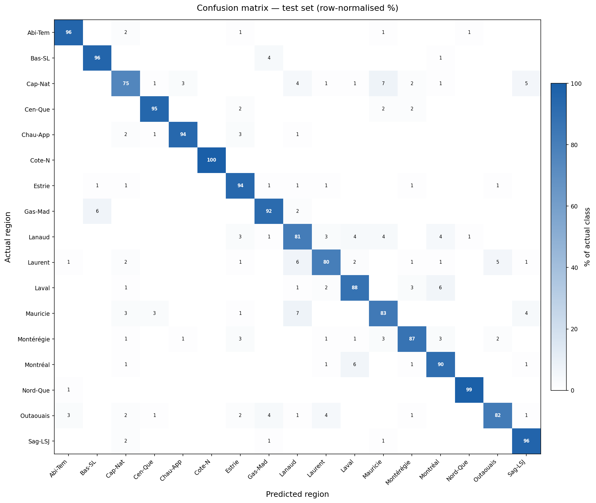

# Quebec Region Classifier

A fine-tuned EfficientNet-V2-M that classifies street-level photos into one of Quebec's 17 administrative regions.

## Results

| Split      | Accuracy |
|------------|----------|
| Validation | 92.0%    |
| Test       | 89.9%    |

The ~2% gap between validation and test accuracy is expected: both splits are drawn from the same image pool, but the test set is held out from the beginning and never influences model selection. The remaining gap reflects genuinely ambiguous cases at administrative borders, where a street photo on either side of a boundary can look identical.

### Per-region accuracy (test set)

| Region                        | Accuracy |
|-------------------------------|----------|
| Cote-Nord                     | 100.0%   |
| Nord-du-Quebec                |  99.1%   |
| Saguenay-Lac-Saint-Jean       |  96.4%   |
| Abitibi-Temiscamingue         |  95.6%   |
| Bas-Saint-Laurent             |  95.5%   |
| Centre-du-Quebec              |  94.6%   |
| Chaudiere-Appalaches          |  93.8%   |
| Estrie                        |  93.8%   |
| Gaspesie-Iles-de-la-Madeleine |  92.0%   |
| Montreal                      |  90.3%   |
| Laval                         |  87.6%   |
| Monteregie                    |  86.7%   |
| Mauricie                      |  83.0%   |
| Outaouais                     |  82.1%   |
| Lanaudiere                    |  81.4%   |
| Laurentides                   |  80.4%   |
| Capitale-Nationale            |  75.0%   |

Geographically isolated regions (Cote-Nord, Nord-du-Quebec, Abitibi-Temiscamingue) are nearly perfect. The main failure modes are adjacent urban or St. Lawrence valley pairs: Capitale-Nationale is confused with Saguenay-Lac-Saint-Jean (6 errors) and Mauricie (8 errors), and the Montreal metro cluster (Montreal / Laval / Monteregie) accounts for most of the remaining errors.

### Confusion matrix



*Row-normalised percentages on the test set. Off-diagonal errors are almost exclusively between geographically adjacent regions.*

## Dataset

Street-level images sourced from the [Mapillary API](https://www.mapillary.com/developer/api-documentation), ~750 per Quebec administrative region.

**Coverage scan** (`data/mapillary_coverage.py`): async grid scan at 0.03° cell resolution to count available images per region (capped at 50k). Results in `data/coverage_results.json`.

**Sampling** (`data/mapillary_sample.py`): downloads a spatially stratified sample of ~750 images per region.
- Grid cells filtered to those whose center falls within the official OSM boundary polygon (cached in `data/region_polygons.gpkg`).
- One image per sequence per cell to avoid near-duplicate dashcam frames.
- Metadata (coordinates, capture date) saved to `data/sample_metadata.csv`.
- Montreal and Laval use a finer 0.008° cell size to account for their high image density and small area.

**Validation** (`data/validate.py`): checks image counts, corrupt files, and spatial spread per region.

**Split** (`data/split.py`): 85/15 stratified train/test split by region, implemented as a symlink tree under `data/dataset/`. An 11.1% stratified validation split is carved from the training set inside the training notebook, giving roughly 75% train / 10% val / 15% test.

## Model

- **Backbone**: EfficientNet-V2-M (ImageNet pretrained via torchvision)
- **Head**: Dropout(0.4) + Linear → 17 classes
- **Input**: 480×480 (cropped from 512×512 cached tensors)
- **Training**: two-phase on Kaggle GPU
  - Phase 1 (5 epochs): head only, AdamW lr=1e-3, backbone frozen
  - Phase 2 (15 epochs): full fine-tune, AdamW lr=5e-5 + CosineAnnealingLR
- **Regularisation**: label smoothing 0.1, gradient accumulation (effective batch 32), mixed precision (AMP)
- **Tracking**: [W&B project](https://wandb.ai/simon-bouchard31-self-employed/geo-classifier-quebec)

The trained model is exported to ONNX (opset 17) and converted to FP16: `models/geoclassifier-v1-fp16.onnx`.

## Inference

### Class labels

The model outputs 17 logits in this order (alphabetical, matching `label_map` in the training notebook):

| Index | Region                        |
|-------|-------------------------------|
| 0     | Abitibi-Temiscamingue         |
| 1     | Bas-Saint-Laurent             |
| 2     | Capitale-Nationale            |
| 3     | Centre-du-Quebec              |
| 4     | Chaudiere-Appalaches          |
| 5     | Cote-Nord                     |
| 6     | Estrie                        |
| 7     | Gaspesie-Iles-de-la-Madeleine |
| 8     | Lanaudiere                    |
| 9     | Laurentides                   |
| 10    | Laval                         |
| 11    | Mauricie                      |
| 12    | Monteregie                    |
| 13    | Montreal                      |
| 14    | Nord-du-Quebec                |
| 15    | Outaouais                     |
| 16    | Saguenay-Lac-Saint-Jean       |

### Preprocessing

Replicate training transforms exactly — silent mismatches here are the most common source of degraded inference accuracy:

1. Resize shortest side / both dimensions to **512×512** (bilinear)
2. Center-crop to **480×480**
3. Convert to float, divide by **255**
4. Normalize with ImageNet stats: mean `[0.485, 0.456, 0.406]`, std `[0.229, 0.224, 0.225]`

```python
import numpy as np
import onnxruntime as ort
from PIL import Image

MEAN = np.array([0.485, 0.456, 0.406], dtype=np.float32)
STD  = np.array([0.229, 0.224, 0.225], dtype=np.float32)

LABELS = [
    "Abitibi-Temiscamingue", "Bas-Saint-Laurent", "Capitale-Nationale",
    "Centre-du-Quebec", "Chaudiere-Appalaches", "Cote-Nord", "Estrie",
    "Gaspesie-Iles-de-la-Madeleine", "Lanaudiere", "Laurentides", "Laval",
    "Mauricie", "Monteregie", "Montreal", "Nord-du-Quebec",
    "Outaouais", "Saguenay-Lac-Saint-Jean",
]

def preprocess(path: str) -> np.ndarray:
    img = Image.open(path).convert("RGB").resize((512, 512), Image.BILINEAR)
    img = img.crop((16, 16, 496, 496))  # center crop 480x480
    x = np.array(img, dtype=np.float32) / 255.0
    x = (x - MEAN) / STD
    return x.transpose(2, 0, 1)[np.newaxis]  # NCHW

sess = ort.InferenceSession("models/geoclassifier-v1-fp16.onnx")
logits = sess.run(["output"], {"input": preprocess("photo.jpg")})[0]
print(LABELS[logits.argmax()])
```

## Project structure

```
data/
  mapillary_coverage.py   # count available images per region
  mapillary_sample.py     # download stratified image sample
  validate.py             # pre-training dataset checks
  split.py                # create train/test symlink tree
  images/                 # generated by mapillary_sample.py (gitignored)
  dataset/                # generated by split.py (gitignored)
  sample_metadata.csv
  region_polygons.gpkg

notebooks/
  geoclassifier-1.ipynb   # training and export

models/                   # model weights are not committed — download from W&B

assets/
  confusion_matrix.png
```

## Setup

```bash
uv sync
echo "MAPILLARY_TOKEN=your_token" > .env
```

Dependencies: `aiohttp`, `geopandas`, `osmnx`, `shapely`, `pandas`, `pillow`, `torch`, `torchvision`, `onnx`, `onnxruntime`.
